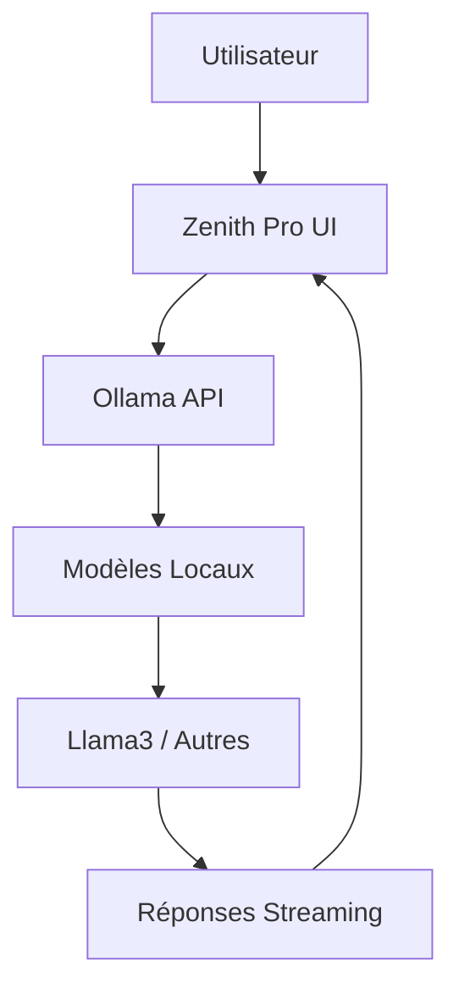

<div align="center">

# 🌟 Zenith Pro

[](https://github.com/divaba101/zenith-pro)
[](https://python.org)
[](https://streamlit.io)
[](LICENSE)

*Le Cockpit Élégant pour ComfyUI - Interface Modulaire pour Générateurs d'Images IA*

[📖 Documentation](#-documentation) • [🚀 Démarrage Rapide](#-installation) • [🔧 API](#-api-documentation) • [🤝 Contribution](#-contribution)

---

### ✨ L'Alchimie de Zenith Pro

Zenith Pro n'est pas un remplacement de ComfyUI. C'est son **partenaire intelligent**. Il se connecte à votre instance existante et la sublime, offrant un espace de création intuitif, organisé et extensible pour les développeurs IA.

> **Imaginez** : Toute la puissance de ComfyUI, sans le chaos technique.

---

</div>

## 📋 Table des Matières

- [🎯 Vue d'Ensemble](#-vue-densemble)
- [✨ Fonctionnalités Principales](#-fonctionnalités-principales)
- [🛠️ Architecture Technique](#️-architecture-technique)
- [📊 Pile Technologique](#-pile-technologique)
- [🚀 Installation](#-installation)
- [📖 Utilisation Rapide](#-utilisation-rapide)
- [🔧 API Documentation](#-api-documentation)
- [🛠️ Développement](#️-développement)
- [🔍 Cas d'Usage](#-cas-dusage-pour-développeurs-ia)
- [🤝 Contribution](#-contribution)
- [📄 Licence](#-licence)
- [📞 Support](#-support)

## 🎯 Vue d'Ensemble

Zenith Pro révolutionne l'interaction avec ComfyUI en offrant :

- **🎨 Interface Streamlit Moderne** : UI élégante et responsive
- **🔄 Gestion Dynamique des Workflows** : Chargement et modification en temps réel
- **💾 Système de Presets Avancé** : Sauvegarde et partage de configurations
- **🤖 Intégration IA Native** : Chat avec modèles locaux via Ollama
- **🛡️ Monitoring Système Intelligent** : Protection contre la surcharge
- **📚 Architecture Modulaire** : Extensible pour développeurs

## ✨ Fonctionnalités Principales

### 🚀 Studio de Création Dynamique

<table>
<tr>
<td width="60%">

Le cœur de Zenith Pro avec une interface adaptative intelligente :

- **Chargement Instantané** : Workflows JSON analysés automatiquement
- **Édition Temps Réel** : Prompts, modèles et paramètres modifiables à la volée
- **Sélecteurs Dynamiques** : Menus déroulants pour Checkpoints, LoRAs, VAEs
- **File de Génération** : Queue asynchrone avec monitoring de progression
- **Mode Turbo** : Optimisation pour générations rapides

</td>
<td width="40%">

```python
# Exemple d'intégration programmatique
from zenith_pro import Studio

studio = Studio()
studio.load_workflow("sdxl_workflow.json")
studio.set_prompt("A beautiful landscape")
studio.generate()
```

</td>
</tr>
</table>

### 💾 Gestionnaire de Presets Intelligent

| Fonctionnalité | Description | Avantages Développeur |
|---------------|-------------|----------------------|
| **Sauvegarde Instantanée** | Configurations complètes en JSON | Versioning automatique |
| **Métadonnées Riches** | Infos sur modèles, paramètres | Recherche et filtrage avancés |
| **Export/Import** | Partage communautaire | Écosystème extensible |
| **Historique Complet** | Tracking des modifications | Debugging facilité |

### 🖼️ Galerie d'Art Personnelle

- **Archivage Automatique** : Images générées indexées automatiquement
- **Métadonnées IA** : Prompt, workflow, modèles associés
- **Recharge Rapide** : Recréation d'une génération depuis l'image
- **Gestion Intelligente** : Suppression, organisation, recherche

### 🤖 AI Chat Intégré



**Fonctionnalités Techniques :**
- Streaming temps réel
- Support multi-modèles
- Contexte conversationnel
- Intégration transparente

### 🛡️ Protection Anti-Surcharge

| Composant | Métrique | Seuil | Action |
|-----------|----------|-------|--------|
| **CPU** | Utilisation % | 90% | Blocage génération |
| **RAM** | Disponible GB | 2GB | Avertissement |
| **GPU** | Mémoire VRAM | 80% | Queue intelligente |
| **Disque** | Espace libre | 5GB | Optimisation cache |

## 🛠️ Architecture Technique

```
zenith-pro/
├── 🏗️ app.py                 # Application principale Streamlit
├── ⚙️ config.py              # Configuration centralisée
├── 📦 requirements.txt       # Dépendances Python
├── 🔧 modules/               # Composants modulaires
│   ├── 🎨 studio.py         # Interface de création
│   ├── 🖼️ gallery.py        # Gestionnaire de galerie
│   ├── 📥 importer.py       # Import de workflows
│   └── 🤖 ai_chat.py        # Chat IA intégré
├── 🛠️ utils/                # Utilitaires spécialisés
│   ├── 🌐 api_comfy.py      # API ComfyUI
│   ├── 🤖 ai_logic.py       # Logique IA
│   └── 🔍 system.py         # Monitoring système
├── 📋 workflows/API/        # Workflows JSON
├── 💾 presets/              # Configurations sauvegardées
└── 📝 logs/                 # Journaux d'application
```

### 🏛️ Principes Architecturaux

- **Modularité** : Chaque fonctionnalité = module indépendant
- **Extensibilité** : API REST pour intégrations tierces
- **Performance** : Monitoring et optimisation automatiques
- **Sécurité** : Validation des entrées et protection système

## 📊 Pile Technologique

| Catégorie | Technologies | Version | Utilisation |
|-----------|-------------|---------|-------------|
| **Frontend** | Streamlit | 1.28+ | Interface utilisateur |
| **Backend** | Python | 3.8+ | Logique applicative |
| **IA/ML** | PyTorch, Safetensors | Latest | Traitement modèles |
| **API** | Requests, WebSocket | - | Communication ComfyUI |
| **Monitoring** | psutil, GPUtil | - | Ressources système |
| **Configuration** | python-dotenv | - | Gestion environnement |
| **Images** | Pillow | - | Traitement visuel |

## 🚀 Installation

### 📋 Prérequis Système

| Composant | Version | Obligatoire | Notes |
|-----------|---------|-------------|-------|
| **Python** | 3.8+ | ✅ | Environnement virtuel recommandé |
| **ComfyUI** | Latest | ✅ | Instance fonctionnelle requise |
| **Ollama** | Latest | ❌ | Pour chat IA uniquement |
| **CUDA** | 11.8+ | ❌ | Accélération GPU optionnelle |

### 🛠️ Installation Automatisée

```bash
# 1. Clonage du dépôt
git clone https://github.com/divaba101/zenith-pro.git
cd zenith-pro

# 2. Installation des dépendances
pip install -r requirements.txt

# 3. Configuration environnement
cp .env.example .env
# Éditez .env avec vos chemins
```

### ⚙️ Configuration Détaillée

```env
# Chemins ComfyUI (obligatoire)
COMFYUI_BASE_PATH=/path/to/your/ComfyUI
COMFYUI_URL=http://127.0.0.1:8188

# Chemins de stockage (optionnel)
GALLERY_PATH=/path/to/gallery
LOCAL_STORAGE_PATH=/path/to/storage

# Configuration IA (optionnel)
OLLAMA_URL=http://localhost:11434/api/chat
OLLAMA_MODEL=llama3

# APIs externes (optionnel)
CIVITAI_API_KEY=your_civitai_key
HUGGINGFACE_API_KEY=your_hf_key
```

### 🚀 Lancement

```bash
# Méthode recommandée (avec venv et logs)
./lancer_ihm.sh

# Méthode manuelle
streamlit run app.py --server.headless true
```

## 📖 Utilisation Rapide

### 🎯 Premier Lancement

1. **Démarrer ComfyUI** :
   ```bash
   cd /path/to/ComfyUI
   python main.py --enable-cors
   ```

2. **Lancer Zenith Pro** :
   ```bash
   cd zenith-pro
   streamlit run app.py
   ```

3. **Configuration Initiale** :
   - Vérifier les chemins dans `.env`
   - Tester la connexion ComfyUI

### 🎨 Workflow Typique

```python
from zenith_pro import ZenithClient

# Initialisation
client = ZenithClient()

# Chargement workflow
workflow = client.load_workflow("default_sdxl.json")

# Configuration
workflow.set_prompt("A majestic eagle in flight")
workflow.set_model("realisticVision.safetensors")
workflow.add_lora("detailEnhancer", strength=0.8)

# Génération
result = client.generate(workflow)
print(f"Image générée: {result.image_path}")
```

## 🔧 API Documentation

### 🌐 Endpoints ComfyUI

| Endpoint | Méthode | Description | Paramètres |
|----------|---------|-------------|------------|
| `/queue` | GET | État de la file | - |
| `/prompt` | POST | Soumettre workflow | `prompt_id`, `workflow` |
| `/history/{id}` | GET | Historique génération | `prompt_id` |
| `/view` | GET | Images générées | `filename`, `subfolder` |

### 🏗️ Classes Principales

#### `ZenithStudio`

```python
class ZenithStudio:
    def __init__(self, comfy_url: str = "http://127.0.0.1:8188")
    def load_workflow(self, path: str) -> Workflow
    def generate(self, workflow: Workflow) -> GenerationResult
    def save_preset(self, name: str, workflow: Workflow) -> bool
```

#### `Workflow`

```python
class Workflow:
    def set_prompt(self, positive: str, negative: str = "") -> None
    def set_model(self, checkpoint: str) -> None
    def add_lora(self, name: str, strength: float = 0.8) -> None
    def set_sampler(self, sampler: str, scheduler: str) -> None
```

### 📡 Intégration WebSocket

```python
import websocket
import json

def on_message(ws, message):
    data = json.loads(message)
    if data.get('type') == 'progress':
        progress = data['data']['value'] / data['data']['max']
        print(f"Progression: {progress:.1%}")

ws = websocket.WebSocketApp("ws://127.0.0.1:8188/ws",
                           on_message=on_message)
ws.run_forever()
```

## 🛠️ Développement

### 🏭 Configuration Développement

```bash
# Environnement virtuel
python -m venv venv
source venv/bin/activate  # Linux/Mac
# venv\Scripts\activate   # Windows

# Installation mode développement
pip install -r requirements-dev.txt
pip install -e .
```

### 🧪 Tests

```bash
# Tests unitaires
pytest tests/

# Tests d'intégration
pytest tests/integration/

# Coverage
pytest --cov=zenith_pro --cov-report=html
```

### 📝 Structure Module

```python
modules/
├── __init__.py
├── base_module.py     # Classe de base
├── studio.py         # Module studio
├── gallery.py        # Module galerie
└── ai_chat.py        # Module chat IA
```

### 🔌 Extension Personnalisée

```python
from zenith_pro.modules import BaseModule

class MyCustomModule(BaseModule):
    def render(self):
        st.title("Mon Module Personnalisé")
        # Logique personnalisée ici

    def api_endpoints(self):
        return {
            '/custom/endpoint': self.custom_handler
        }
```

## 🔍 Cas d'Usage pour Développeurs IA

### 🤖 Fine-tuning de Modèles

```python
# Intégration avec entraînement personnalisé
from zenith_pro import ModelManager

manager = ModelManager()
model = manager.load_custom_model("my_fine_tuned.ckpt")

# Test rapide via interface
studio = ZenithStudio()
studio.test_model(model, test_prompts=["test1", "test2"])
```

### 📊 Analyse de Performance

```python
from zenith_pro.utils import PerformanceAnalyzer

analyzer = PerformanceAnalyzer()

# Benchmark génération
results = analyzer.benchmark(workflow, iterations=10)
print(f"Temps moyen: {results.mean_time:.2f}s")
print(f"Utilisation GPU: {results.gpu_usage:.1f}%")
```

### 🔗 Intégration CI/CD

```yaml
# .github/workflows/test.yml
name: Test Zenith Pro
on: [push, pull_request]
jobs:
  test:
    runs-on: ubuntu-latest
    steps:
    - uses: actions/checkout@v3
    - name: Setup Python
      uses: actions/setup-python@v4
      with:
        python-version: '3.9'
    - name: Install dependencies
      run: pip install -r requirements.txt
    - name: Run tests
      run: pytest
```

## 🔭 Feuille de Route

- [ ] **Aperçu Live** : Visualisation temps réel de génération
- [ ] **Batch Processing** : Génération par lots optimisée
- [ ] **LoRA Chain Editor** : Éditeur visuel de chaînes LoRA
- [ ] **Model Compatibility** : Détection automatique SD1.5/SDXL
- [ ] **Plugin System** : Architecture de plugins extensibles
- [ ] **Cloud Integration** : Support déploiement cloud

## 🤝 Contribution

### 📋 Processus de Contribution

1. **Fork** le projet
2. **Clone** votre fork : `git clone https://github.com/your-username/zenith-pro.git`
3. **Créez** une branche : `git checkout -b feature/amazing-feature`
4. **Commit** vos changements : `git commit -m 'Add amazing feature'`
5. **Push** vers la branche : `git push origin feature/amazing-feature`
6. **Ouvrez** une Pull Request

### 🐛 Signalement de Bugs

Utilisez le template de bug dans [Issues](https://github.com/divaba101/zenith-pro/issues/new?template=bug_report.md)

### 💡 Proposition de Fonctionnalités

Utilisez le template de feature dans [Issues](https://github.com/divaba101/zenith-pro/issues/new?template=feature_request.md)

### 📏 Standards de Code

- **PEP 8** pour le style Python
- **Type hints** obligatoires
- **Docstrings** complètes
- **Tests unitaires** pour toute nouvelle fonctionnalité

## 📄 Licence

Ce projet est sous licence **MIT**. Voir le fichier [LICENSE](LICENSE) pour plus de détails.

## 📞 Support

- 📧 **Email** : [contact@zenith-pro.dev](mailto:contact@zenith-pro.dev)
- 💬 **Discord** : [Rejoignez notre communauté](https://discord.gg/zenith-pro)
- 📖 **Documentation** : [docs.zenith-pro.dev](https://docs.zenith-pro.dev)
- 🐛 **Issues** : [GitHub Issues](https://github.com/divaba101/zenith-pro/issues)

---

<div align="center">

**Fait avec ❤️ par la communauté IA**

⭐ Si ce projet vous plaît, n'hésitez pas à lui donner une étoile !

[⬆️ Retour en haut](#-zenith-pro)

</div>
