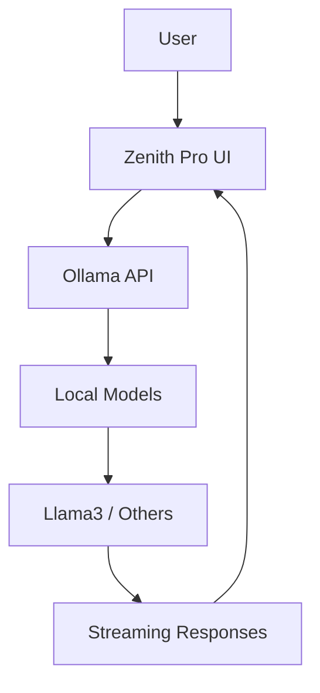

<div align="center">

# 🌟 Zenith Pro

[](https://github.com/divaba101/zenith-pro)
[](https://python.org)
[](https://streamlit.io)
[](LICENSE)

*The Elegant Cockpit for ComfyUI - Modular Interface for AI Image Generators*

[📖 Documentation](#-documentation) • [🚀 Quick Start](#-installation) • [🔧 API](#-api-documentation) • [🤝 Contribution](#-contribution)

---

### ✨ The Zenith Pro Alchemy

Zenith Pro is not a replacement for ComfyUI. It's its **intelligent partner**. It connects to your existing instance and elevates it, providing an intuitive, organized, and extensible creative space for AI developers.

> **Imagine**: All the power of ComfyUI, without the technical chaos.

---

</div>

## 📋 Table of Contents

- [🎯 Overview](#-overview)
- [✨ Key Features](#-key-features)
- [🛠️ Technical Architecture](#️-technical-architecture)
- [📊 Tech Stack](#-tech-stack)
- [🚀 Installation](#-installation)
- [📖 Quick Start](#-quick-start)
- [🔧 API Documentation](#-api-documentation)
- [🛠️ Development](#️-development)
- [🔍 Use Cases for AI Developers](#-use-cases-for-ai-developers)
- [🤝 Contribution](#-contribution)
- [📄 License](#-license)
- [📞 Support](#-support)

## 🎯 Overview

Zenith Pro revolutionizes interaction with ComfyUI by offering:

- **🎨 Modern Streamlit Interface**: Elegant and responsive UI
- **🔄 Dynamic Workflow Management**: Real-time loading and editing
- **💾 Advanced Preset System**: Configuration saving and sharing
- **🤖 Native AI Integration**: Chat with local models via Ollama
- **🛡️ Intelligent System Monitoring**: Protection against overload
- **📚 Modular Architecture**: Extensible for developers

## ✨ Key Features

### 🚀 Dynamic Creation Studio

<table>
<tr>
<td width="60%">

The heart of Zenith Pro with an intelligent adaptive interface:

- **Instant Loading**: JSON workflows automatically parsed
- **Real-time Editing**: Prompts, models, and parameters modifiable on the fly
- **Dynamic Selectors**: Dropdown menus for Checkpoints, LoRAs, VAEs
- **Generation Queue**: Asynchronous queue with progress monitoring
- **Turbo Mode**: Optimization for fast generations

</td>
<td width="40%">

```python
# Programmatic integration example
from zenith_pro import Studio

studio = Studio()
studio.load_workflow("sdxl_workflow.json")
studio.set_prompt("A beautiful landscape")
studio.generate()
```

</td>
</tr>
</table>

### 💾 Intelligent Preset Manager

| Feature | Description | Developer Benefits |
|---------|-------------|-------------------|
| **Instant Saving** | Complete configurations in JSON | Automatic versioning |
| **Rich Metadata** | Model and parameter info | Advanced search and filtering |
| **Export/Import** | Community sharing | Extensible ecosystem |
| **Complete History** | Change tracking | Easier debugging |

### 🖼️ Personal Art Gallery

- **Automatic Archiving**: Generated images automatically indexed
- **AI Metadata**: Associated prompts, workflows, models
- **Quick Reload**: Recreate a generation from the image
- **Smart Management**: Deletion, organization, search

### 🤖 Integrated AI Chat



**Technical Features:**
- Real-time streaming
- Multi-model support
- Conversational context
- Seamless integration

### 🛡️ Anti-Overload Protection

| Component | Metric | Threshold | Action |
|-----------|--------|-----------|--------|
| **CPU** | Usage % | 90% | Block generation |
| **RAM** | Available GB | 2GB | Warning |
| **GPU** | VRAM Memory | 80% | Smart queue |
| **Disk** | Free Space | 5GB | Cache optimization |

## 🛠️ Technical Architecture

```
zenith-pro/
├── 🏗️ app.py                 # Main Streamlit application
├── ⚙️ config.py              # Centralized configuration
├── 📦 requirements.txt       # Python dependencies
├── 🔧 modules/               # Modular components
│   ├── 🎨 studio.py         # Creation interface
│   ├── 🖼️ gallery.py        # Gallery manager
│   ├── 📥 importer.py       # Workflow importer
│   └── 🤖 ai_chat.py        # Integrated AI chat
├── 🛠️ utils/                # Specialized utilities
│   ├── 🌐 api_comfy.py      # ComfyUI API
│   ├── 🤖 ai_logic.py       # AI logic
│   └── 🔍 system.py         # System monitoring
├── 📋 workflows/API/        # JSON workflows
├── 💾 presets/              # Saved configurations
└── 📝 logs/                  # Application logs
```

### 🏛️ Architectural Principles

- **Modularity**: Each feature = independent module
- **Extensibility**: REST API for third-party integrations
- **Performance**: Automatic monitoring and optimization
- **Security**: Input validation and system protection

## 📊 Tech Stack

| Category | Technologies | Version | Usage |
|----------|-------------|---------|-------|
| **Frontend** | Streamlit | 1.28+ | User interface |
| **Backend** | Python | 3.8+ | Application logic |
| **AI/ML** | PyTorch, Safetensors | Latest | Model processing |
| **API** | Requests, WebSocket | - | ComfyUI communication |
| **Monitoring** | psutil, GPUtil | - | System resources |
| **Configuration** | python-dotenv | - | Environment management |
| **Images** | Pillow | - | Visual processing |

## 🚀 Installation

### 📋 System Requirements

| Component | Version | Required | Notes |
|-----------|---------|----------|-------|
| **Python** | 3.8+ | ✅ | Virtual environment recommended |
| **ComfyUI** | Latest | ✅ | Functional instance required |
| **Ollama** | Latest | ❌ | For AI chat only |
| **CUDA** | 11.8+ | ❌ | Optional GPU acceleration |

### 🛠️ Automated Installation

```bash
# 1. Clone repository
git clone https://github.com/divaba101/zenith-pro.git
cd zenith-pro

# 2. Install dependencies
pip install -r requirements.txt

# 3. Environment setup
cp .env.example .env
# Edit .env with your paths
```

### ⚙️ Detailed Configuration

```env
# ComfyUI paths (required)
COMFYUI_BASE_PATH=/path/to/your/ComfyUI
COMFYUI_URL=http://127.0.0.1:8188

# Storage paths (optional)
GALLERY_PATH=/path/to/gallery
LOCAL_STORAGE_PATH=/path/to/storage

# AI configuration (optional)
OLLAMA_URL=http://localhost:11434/api/chat
OLLAMA_MODEL=llama3

# External APIs (optional)
CIVITAI_API_KEY=your_civitai_key
HUGGINGFACE_API_KEY=your_hf_key
```

### 🚀 Launch

```bash
# Recommended method (with venv and logs)
./lancer_ihm.sh

# Manual method
streamlit run app.py --server.headless true
```

## 📖 Quick Start

### 🎯 First Launch

1. **Start ComfyUI**:
   ```bash
   cd /path/to/ComfyUI
   python main.py --enable-cors
   ```

2. **Launch Zenith Pro**:
   ```bash
   cd zenith-pro
   streamlit run app.py
   ```

3. **Initial Configuration**:
   - Check paths in `.env`
   - Test ComfyUI connection

### 🎨 Typical Workflow

```python
from zenith_pro import ZenithClient

# Initialization
client = ZenithClient()

# Load workflow
workflow = client.load_workflow("default_sdxl.json")

# Configuration
workflow.set_prompt("A majestic eagle in flight")
workflow.set_model("realisticVision.safetensors")
workflow.add_lora("detailEnhancer", strength=0.8)

# Generation
result = client.generate(workflow)
print(f"Generated image: {result.image_path}")
```

## 🔧 API Documentation

### 🌐 ComfyUI Endpoints

| Endpoint | Method | Description | Parameters |
|----------|--------|-------------|------------|
| `/queue` | GET | Queue status | - |
| `/prompt` | POST | Submit workflow | `prompt_id`, `workflow` |
| `/history/{id}` | GET | Generation history | `prompt_id` |
| `/view` | GET | Generated images | `filename`, `subfolder` |

### 🏗️ Main Classes

#### `ZenithStudio`

```python
class ZenithStudio:
    def __init__(self, comfy_url: str = "http://127.0.0.1:8188")
    def load_workflow(self, path: str) -> Workflow
    def generate(self, workflow: Workflow) -> GenerationResult
    def save_preset(self, name: str, workflow: Workflow) -> bool
```

#### `Workflow`

```python
class Workflow:
    def set_prompt(self, positive: str, negative: str = "") -> None
    def set_model(self, checkpoint: str) -> None
    def add_lora(self, name: str, strength: float = 0.8) -> None
    def set_sampler(self, sampler: str, scheduler: str) -> None
```

### 📡 WebSocket Integration

```python
import websocket
import json

def on_message(ws, message):
    data = json.loads(message)
    if data.get('type') == 'progress':
        progress = data['data']['value'] / data['data']['max']
        print(f"Progress: {progress:.1%}")

ws = websocket.WebSocketApp("ws://127.0.0.1:8188/ws",
                           on_message=on_message)
ws.run_forever()
```

## 🛠️ Development

### 🏭 Development Setup

```bash
# Virtual environment
python -m venv venv
source venv/bin/activate  # Linux/Mac
# venv\Scripts\activate   # Windows

# Development mode installation
pip install -r requirements-dev.txt
pip install -e .
```

### 🧪 Testing

```bash
# Unit tests
pytest tests/

# Integration tests
pytest tests/integration/

# Coverage
pytest --cov=zenith_pro --cov-report=html
```

### 📝 Module Structure

```python
modules/
├── __init__.py
├── base_module.py     # Base class
├── studio.py         # Studio module
├── gallery.py        # Gallery module
└── ai_chat.py        # AI chat module
```

### 🔌 Custom Extension

```python
from zenith_pro.modules import BaseModule

class MyCustomModule(BaseModule):
    def render(self):
        st.title("My Custom Module")
        # Custom logic here

    def api_endpoints(self):
        return {
            '/custom/endpoint': self.custom_handler
        }
```

## 🔍 Use Cases for AI Developers

### 🤖 Model Fine-tuning

```python
# Integration with custom training
from zenith_pro import ModelManager

manager = ModelManager()
model = manager.load_custom_model("my_fine_tuned.ckpt")

# Quick testing via interface
studio = ZenithStudio()
studio.test_model(model, test_prompts=["test1", "test2"])
```

### 📊 Performance Analysis

```python
from zenith_pro.utils import PerformanceAnalyzer

analyzer = PerformanceAnalyzer()

# Generation benchmark
results = analyzer.benchmark(workflow, iterations=10)
print(f"Average time: {results.mean_time:.2f}s")
print(f"GPU usage: {results.gpu_usage:.1f}%")
```

### 🔗 CI/CD Integration

```yaml
# .github/workflows/test.yml
name: Test Zenith Pro
on: [push, pull_request]
jobs:
  test:
    runs-on: ubuntu-latest
    steps:
    - uses: actions/checkout@v3
    - name: Setup Python
      uses: actions/setup-python@v4
      with:
        python-version: '3.9'
    - name: Install dependencies
      run: pip install -r requirements.txt
    - name: Run tests
      run: pytest
```

## 🔭 Roadmap

- [ ] **Live Preview**: Real-time generation visualization
- [ ] **Batch Processing**: Optimized batch generation
- [ ] **LoRA Chain Editor**: Visual LoRA chains editor
- [ ] **Model Compatibility**: Automatic SD1.5/SDXL detection
- [ ] **Plugin System**: Extensible plugin architecture
- [ ] **Cloud Integration**: Cloud deployment support

## 🤝 Contribution

### 📋 Contribution Process

1. **Fork** the project
2. **Clone** your fork: `git clone https://github.com/your-username/zenith-pro.git`
3. **Create** a branch: `git checkout -b feature/amazing-feature`
4. **Commit** your changes: `git commit -m 'Add amazing feature'`
5. **Push** to the branch: `git push origin feature/amazing-feature`
6. **Open** a Pull Request

### 🐛 Bug Reporting

Use the bug template in [Issues](https://github.com/divaba101/zenith-pro/issues/new?template=bug_report.md)

### 💡 Feature Requests

Use the feature template in [Issues](https://github.com/divaba101/zenith-pro/issues/new?template=feature_request.md)

### 📏 Code Standards

- **PEP 8** for Python style
- **Type hints** required
- **Complete docstrings** required
- **Unit tests** for all new features

## 📄 License

This project is under the **MIT** license. See the [LICENSE](LICENSE) file for more details.

## 📞 Support

- 📧 **Email**: [contact@zenith-pro.dev](mailto:contact@zenith-pro.dev)
- 💬 **Discord**: [Join our community](https://discord.gg/zenith-pro)
- 📖 **Documentation**: [docs.zenith-pro.dev](https://docs.zenith-pro.dev)
- 🐛 **Issues**: [GitHub Issues](https://github.com/divaba101/zenith-pro/issues)

---

<div align="center">

**Made with ❤️ by the AI community**

⭐ If you like this project, don't forget to give it a star!

[⬆️ Back to top](#-zenith-pro)

</div>
